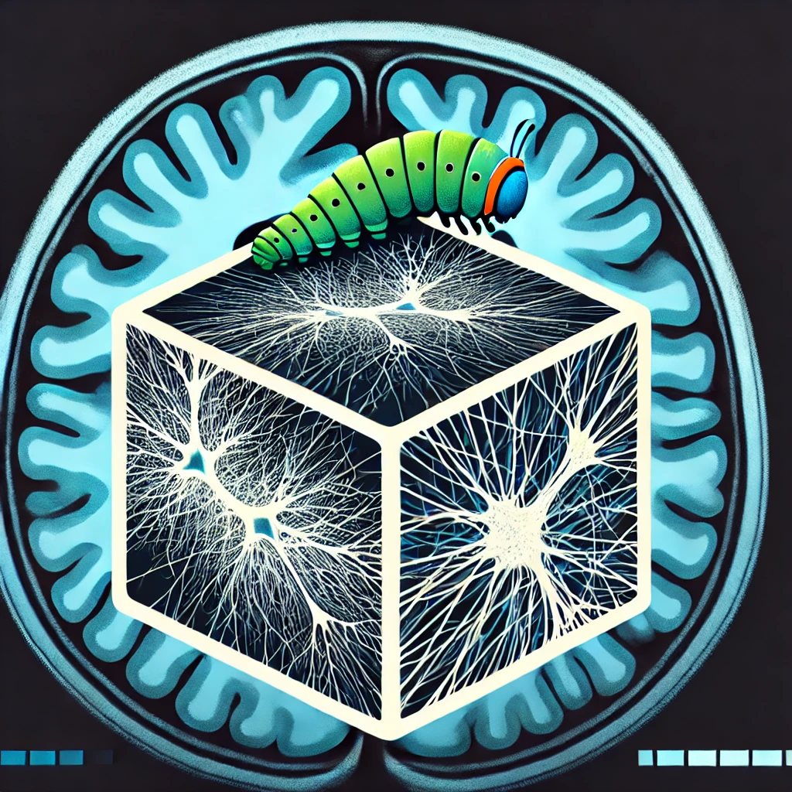

# CATERPillar



## **Introduction**
CATERPillar (**Computational Axonal Threading Engine for Realistic Proliferation**) is an advanced computational framework designed to simulate natural axonal growth using overlapping spheres as fundamental building blocks. By employing a biologically inspired approach, CATERPillar enables parallel axon development while effectively preventing collisions, allowing users to control key structural parameters such as **density, tortuosity, and beading**.

What sets CATERPillar apart is its ability to generate not only realistic **axonal architectures** but also **glial cell structures**, significantly enhancing the biological fidelity of tissue microstructure simulations. This makes it a valuable tool for studying brain tissue models and validating diffusion-based imaging techniques.

## **How to Run the Program**
To run CATERPillar, follow these steps:

1. **Download the code** from the repository.
2. Make sure you have the necessary packages installed by running:
   ```bash
   sudo apt update
   sudo apt install libqt5datavisualization5
   sudo apt-get install libboost-all-dev
   ```
4. Navigate to the `GUI` folder using the terminal:
   ```bash
   cd GUI
   ```
5. Execute the program by running:
   ```bash
   ./Caterpillar
   ```

This will launch the graphical user interface, allowing users to configure parameters and generate realistic numerical substrates for simulations. To generate a new numerical substrate, press on the "Grow Substrate" button. If you wish to visualise a substrate already grown, press on the "Visualise Substrate" button. 


## **List of Parameters**

### **General Parameters:**
- **Voxel Edge Length (μm):** Defines the length of the cubic substrate, determining the overall volume of the simulation space.
- **Overlapping Factor:** Controls the spacing between consecutive spheres during axonal growth. The distance is computed as max(R1, R2) / F, where R1 and R2 are the radii of two consecutive spheres, and F is the chosen overlapping factor. A higher overlapping factor results in closer sphere placement, reducing the gaps between spheres. A recommended value for optimal results is **4**.
- **Minimum Sphere Radius (μm):** Specifies the smallest allowable sphere radius within the voxel. This constraint helps prevent excessively narrow spaces that could impede Monte Carlo Simulations.
- **Visualise Voxel:** Ticking the box will allow the GUI to plot the substrate generated once the gorwth is completed.
   
### **Axon Parameters:**
- **Axons with Myelin ICVF (%):** Defines the volume fraction occupied by myelinated axons, including the myelin compartment. The g-ratio for each axon is assigned based on a log-linear relationship between the inner radius and the g-ratio.
- **$$K_1$$, $$K_2$$ and $$K_3$$ parameters :** This is to define the relationship between the inner diameter of the axons and the myelin thickness : 

$$
\text{Myelin thickness} = K_1 + K_2 \cdot D_\text{in} + K_3 \cdot \log(D_\text{in})
$$

This log-linear fit was proposed by Lee et al. (DOI : 10.1007/s00429-019-01844-6) with $$K_1$$ = 0.35, $$K_2$$ = 0.006 and $$K_3$$ = 0.024. 
- **Axons ICVF (%):** Specifies the volume fraction of non-myelinated axons within the voxel.
- **Number of Threads:** Determines the number of axons that can grow simultaneously during the simulation, impacting computational efficiency.
- **ε (Tortuosity):** Represents the standard deviation of the Gaussian distribution governing the 3D positioning of spheres during axonal growth. Higher values result in increased axonal tortuosity.
- **c₂ (Fibre Orientation Dispersion Function - fODF):** Defined as ⟨cos²ψ⟩, where ψ is the angle between the axon growth direction and the z-axis. This parameter quantifies the degree of fibre orientation dispersion within the substrate.
- **Number of Axon Populations:** Specifies the number of distinct axonal populations that can grow within the substrate, with a range of 1-3. Each population adopts a primary orientation perpendicular to the others. If two populations are selected, users can choose between a **sheet configuration** or an **interwoven configuration**.
- **Beading Amplitude:** Defines the amplitude of axonal beading as a fraction of the axon's initial radius, influencing morphological variability.
- **Gamma Distribution for Radii (α):** Shape parameter for the Gamma distribution governing axon radii. A recommended value for realistic axon widths is **4**.
- **Gamma Distribution for Radii (β):** Scale parameter for the Gamma distribution governing axon radii. A recommended value for realistic axon widths is **0.25**.

### **Glial Cell Parameters:**
- **Somas ICVF (%):** Defines the volume fraction occupied by astrocyte somas within the substrate.
- **Processes ICVF (%):** Specifies the volume fraction of astrocyte processes, contributing to the extracellular microstructure.
- **Soma radius mean (μm):** Mean radius of the somas. The soma for each glial cell is drawn from a normal distribution with this value as a mean.
- **Soma radius standard deviation (μm):** Standard deviation for the radius of the somas. The soma for each glial cell is drawn from a normal distribution with this value as a standard deviation.
- **Mean Process Length (μm):** Represents the average length of processes within the substrate. THis length starts from the soma and ends at the tip of the process. Secondary process, that branch from primary ones, will have a shorter length because we take into account the distance already grown before the bifurcation.
- **Standard Deviation for Process Length (μm):** Defines the variability in process lengths, contributing to the heterogeneity of the substrate.

- **Number of primary processes:** Number of processes that emerge directly from soma. 

- **Can glial cell population have branching:** If this box is ticked, the glial cell can have hogher order processes. If not, only primary processes will be present. If the volume fraction for processes cannot be reached with the number of primaary processes selected, more of them will grow. 


Two different populations of glial cells can co-exist in a voxel. So, two boxes are present with all of these parameters. 
## **Output**

Once the simulation is complete, the **GUI** will display the generated substrate, allowing users to visually inspect the microstructure. Additionally, the GUI provides options to plot:
- **Axonal radii distribution**
- **Axonal tortuosity distribution**
- **Sholl analysis for astrocytes**

These visualization tools help in analyzing the structural properties of the generated substrate.

### **Generated Files**
Upon completion, the following output files will be created in the selected directory:

1. **`voxel.swc`** – Contains detailed information about the substrate, with each line defining a sphere’s properties.
2. **`voxel_info.txt`** – Provides metadata and summary statistics related to the generated substrate, including parameters used during the simulation.

These files can be used for further analysis, integration with external tools, or validation against experimental data.


